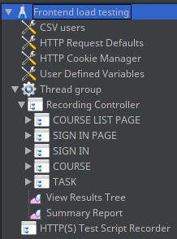
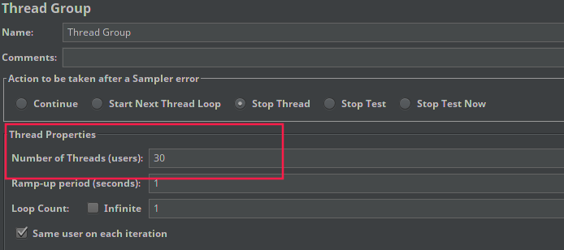
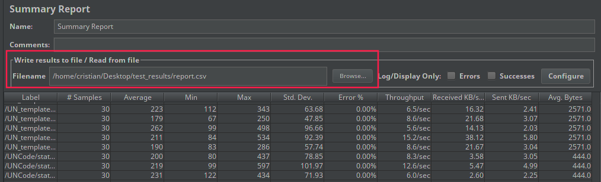

# UNCode - Testing

[][gitter_url]
[][license_url]
[][contributors_url]
[][cla_url]

In this repository you can find the different tests done for UNCode.

By the moment the only testing we have does for _load testing_. Load testing is intended to see and
 measure the server behavior when several users are trying to use the app at the same time. This could be sign in,
 going to a task page and make a submission. This testing is done via `JMeter`, testing several workflows 
 like frontend performance or Notebook submissions.

## Getting started

### Dependencies

- [JMeter][jmeter_url]

## Load testing

Here we describe how the load testing is done using JMeter. The testings we do here are to
check performance of Frontend, Multilang and Notebook submissions.

### Initial settings

In order to be able to run the tests, you must do some first settings and steps:

#### 1. Create tasks on UNCode

In the folder `tasks/` there is an example of a course called `grader-1`. You can add this
course in the server tasks folder (`/var/www/INGInious/tasks`) or use a test course you have already created.

Inside `tasks/` folder, there are two example tasks:

- **TestTask1:** This is an example of multilang task. This task is used for the load test called
`Multilang load test.jmx`.
- **TestTaskProject:** This is an example related to multiple languages file submission. You can also
 find some project files in the folder `project_examples/`, here you will find several *.zip*
 files in several languages. There is not a load test related to this task, however, in case you
 want to create one, it is quite similar to the notebook load test.

#### 2. Insert users to DB

First of all, you need to insert some dummy users to the Database. That way you can simulate
several users logging in and submitting code.

For that, you can find the **mongo.js** file. Run the next command
`mongo TestINGInious < mongo.js` to insert the users. Keep in mind we are modifying a database for
testing, thus, you must update the _configuration.yaml_ file with the *testing DB*.

This registers 1000 students in the provided testing course `grader-1`. You can modify the last line of this
 script with the course where you want to register the students to.

Now you are ready to start testing UNCode with **JMeter**.

### Start testing

The main goal of these tests is to measure the server performance. For that, there are various ways
to achieve that, they are Frontend, multiple languages submission and Notebook submission.

To compare correctly the several tests, we created a unique workflow that users usually do. This
is:

1. Open UNCode (/courselist).
2. Go to sign in page.
3. Log in to UNCode.
4. Go to the course (identified as _grader-1_).
5. Select and open the task (either _TestTask1_ or _notebook_).
6. Submit the code (only for the case of Multiple languages and Notebook tests).

#### Components

The components present in one test are present across all tests. These components are explained
bellow as the image shows:



- **CSV users**: This component is used to load the necessary users to do the test. You have to set the file you are going to use (You can find and example on **users_set.csv** file).
- **HTTP Request Defaults**: Component to manage the default values used for the whole test. You only have to configure the _server name_ or _IP_ and _port_ of server you are testing.
- **HTTP Cookie Manager**: This component is in charge of managing the cookies during the test execution, that way, the user is logged in during all requests.
- **User defined variables**: Component usefull to set some variables that can be used during some
requests.
- **Thread Group**: Here is where you must set the amount of concurrent users using UNCode. This
also contains all requests done for that:
  - _COURSE LIST PAGE_: This compones groups all necessary requests to load the initial page.
  - _SIGN IN PAGE_: component that groups requests when user goes to the signin page.
  - _SIGN IN_: groups requests when user logs in and is redirected to _/mycourses_ page. This
  component uses the users loaded in the _CSV users_ component.
  - _COURSE_: here you go to the course page, for all tests, this is identified by `grader-1`.
  - _TASK_: this component groups the action to select the task the user wants to submit code, as
  stated before, depending on the test this is identified by either `TestTask1` or `notebook`.

- **View Results Tree**:  here every request is shown and all info related to it like response,
payload, Headers, among others. Useful to know why a request fails.
- **Summary Report**: Shows the results of running the test in a table with the response time
average, min and max of all requests, error percentage, throughput, among others.

##### Frontend

Load Test intended to measure the performance of Frontend with several concurrent users, this
helps us to know how is the performance of Nginx and Lighttpd services when no submissions are running. The workflow of this test is the same described above where the user opens the task `TestTask1`.

The file related to this test is `Frontend load test.jmx`.

##### Multiple languages submission

This test is intended to understand and measure the behavior of the server when there are several users concurrently submitting code to the same task. This also gives an approach of how many concurrent users we are able to support.

The file related to this test is `Multilang load test.jmx`.

##### Notebook file submission

Test is intended to understand and measure the behavior of the server when there are several users concurrently submitting an .ipynb file to UNCode. This teste helps us to determine if this kind of
tasks increases the load in the server in comparison with multilang tasks.

The file related to this test is `Notebook load test.jmx`.

### How to run the tests

Firstly, make sure JMeter is installed. Then follow next steps:

1. Open the Test plan you want use with JMeter
2. In _Thread Group_ set the number of threads or concurrent users you want to test the server with.
    

3. **Run the test:**
    For this, you have two options, using either the graphical start button or in non
    GUI mode (command). We encourage you to run the test in non GUI mode as this creates all
    threads faster and measures more accurate the data.
    To run the test in non GUI mode, run next command:

    ```bash
    jmeter -n -t /path/to/test/file.jmx -l /path/to/results/file.jtl -j /path/to/log/file.log
    ```

    After running this command, this creates a `.jtl` file which contains all requests done by
    JMeter measuring all necessary data.

4. **Open `jtl` file:**
    In case you executed the test in non GUI mode, you can open the results file with JMeter, so
    you can read easily and they are shown in a table. For that, in the _Summary Report_
    component. The, open the file that was just created as shown in the next image and JMeter will
    do all calculations for you.

    

    As you can see in the image, JMeter shows the results in a table for all the launched threads.

## Documentation

For additional documentation about UNCode, please refer to the [Wiki][uncode_wiki_url].

## Roadmap

See the [UNCode GitHub Project][project_url] for a list of proposed features for UNCode, known issues and how they are
 being tackled.

## Contributing

Go to [CONTRIBUTING][contributing_url] to see the guidelines and how to start contributing to UNCode.

## License

Distributed under the AGPL-3.0 License. See [LICENSE][license_url] for more information.

## Contact

In case of technical questions, please use the [gitter communication channel][gitter_url].

In case you want to host your course on our deployment, email us on: <uncode_fibog@unal.edu.co>

UNCode: <https://uncode.unal.edu.co>

Project page: <https://juezun.github.io/UNCode_page/>

[jmeter_url]: https://jmeter.apache.org/
[uncode_wiki_url]: https://github.com/JuezUN/INGInious/wiki
[project_url]: https://github.com/orgs/JuezUN/projects/3
[contributing_url]: https://github.com/JuezUN/Testin/blob/master/CONTRIBUTING.md
[gitter_url]:https://gitter.im/uncode-unal/community?utm_source=badge&utm_medium=badge&utm_campaign=pr-badge
[repository_url]: https://github.com/JuezUN/Testing
[contributors_url]: https://github.com/JuezUN/Testing/graphs/contributors
[cla_url]: https://cla-assistant.io/JuezUN/Testing
[license_url]: https://github.com/JuezUN/Testing/blob/master/LICENSE