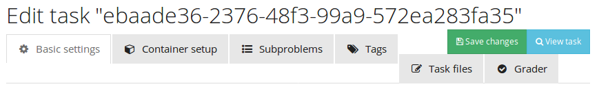
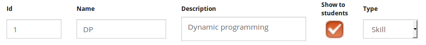

## Functionality and usability testing

* Tools button on submission page shouldn't be shown if you are not authenticated or show a message (alert in the top) that shows you you need to be authenticated.

* I haven't tested qb64, as my computer 'dies' submitting this file.

* Paginate mycourses, as you can be enrolled in many courses, for instance, the superadmin is going to see all courses and it could be extensive.(order in courses)

* When course is hidden, course administration button is not shown well.

* Autosuggest when adding tutors and admins on course.

* Would be better to upload a CSV file with the users that are going to be registered on a course.

* When task ID is too long, happens what follows:

  

  The last tabs are moved.

* The already solved bug (on INGInious-old) when the task is created and then removed.

*  While creating a new course (typing course id), we should show a message that the only available characters are alphanumeric plus '_' and '-', as currently it only shows a message that failed to create a course.

* **Editing a task**: 

  * we have to specify more what is the task's context and the subproblem's context

  * A message that shows that you should only select  multiple_languages as grading environment, or disable the other options.

  * Show that you must to create only one subproblem, or do this more intuitive.

  * Try to modify this check-button (prettier and maybe smaller)

     

  * Do not allow that you can edit, move/rename,  or delete run file.

  * On the grader, do not show as an option for test case the run file or files that have been already taken as test case.

  * We should hide problem types that are not needed, show only *code* and *code_file multiple language* types.

  * **While writing the task's or subproblem's context we should show some tips about how to write a better context, for instance, how to set italic or bold words, upload images, titles, among others.**

  * In task files tab, the buttons to create or update a file should be located at the top of the page instead of the bottom, as the amount of files rises, you always have to scroll down to find those buttons.

  * TAGS: When you edit a tag and if the tag's type is changed the id get lost

*  On course settings, I think that *how to create a task?* and *Documentation* buttons (bellow course menu) should redirect to a real manual specialized to UNCode and multiple languages, and the documentation button is not necessary.

* **Statistics**

  * ~~***Download CSV* option does not work, if it is not available, it shouldn't be shown to the user**~~(JS code to check if option is available).
  * ~~**When the results are shown as table, the submission code is a link, but it redirects to a broken link.**~~(In the code the direction just use the subsection submissions. The course id, task id, etc. are unnecessary.)
  * **On *Submissions Verdict (ALL) and (BEST)* statistics, the shown task should display the task's name not task's ID**.

* What about input and output examples in the explanation of the task?

* **Submission**

  * If the output test file there is not an blank line at the end, the judge could send wrong answer (testing with python).
  * The available languages should be shown in alphabetical order.
  * **Submitting code in python 2.7 takes the code as python 3.5 (Changing from python 3.5 to 2.7 when the code is already on the editor, actually, it does not change to 2.7.**
  * If the code does not coincide with the selected, the linter does not show anything.

* **Problem Bank:**

  * When you search a task, it does not ignore the case (Is case sensitive). So, we should allow a no case sensitive searching.
  * Showing task's info, we should show the context in a proper way, as it is shown when you open the task.
  * Should we modify task's name when the task that is being copied from a course to the same course.
  * Button *Go to task* on every task.
