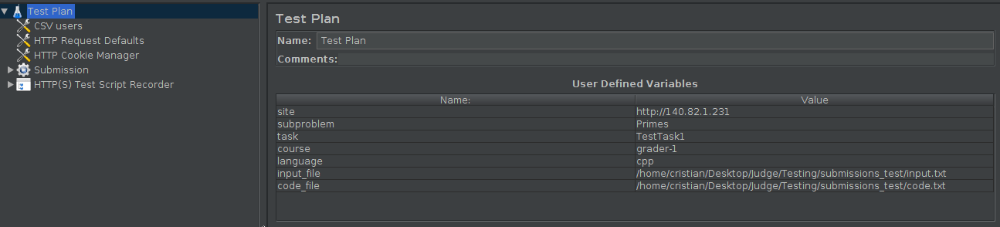

## Load testing

#### Submission test

This test is intended to see and measure the behavior of the server when there are several users submitting the  same task at the same time.

There are to tests, **code_file_submission_test.jmx** is to test custom input when the task is file submission. **code_submission_test.jmx**  is to test custom input when the task is only code. This testing is done with JMeter, so the only stuff that you have to do is open this file.

Following are explained the different components:

- *CSV users*: This component is used to get the necessary users to do the test. You have to set the file you are going to use (You can find and example on **users_set.csv** file).
- *HTTP Request Defaults*: Component to manage the default values use for the whole test. You only have to configure the server name or IP and the port.
- Submission: Thread group where you set the number of users or threads you are going to use for your test.
  - _Login_: In this component the sign in is managed for every user.
  - *Register for a course*: here the request to register for a course is managed.
  -  _Go to course_: here you emulate the process to got to the course.
  - *Submission page*: here you go to the task page which you want to submit the code.
  - *Submission*: in this component, you can submit the task. You have to set the values for the different parameters.

**Note**: every request has a Results Tree to view the result for the request and every thread.

The **summary report** shows the different statistics for the whole test.

Finally, the only changes that you have to do is on the variables shown in following image:

Following are explained all variables:

* *subproblem*: Here you set the id of the subproblem which you want to test.
* *task*: is the task id of the task you want to test.
* *course*: course id of the where is located the task you want to test.
* *language*: here you set the language of the code you want to submit.
* *input_file*: here you set the path to a file where you set the custom input that is going to be test. (You can find an **input.txt** as an example)
* *code_file*: here you set the path to the file where the code is located. *This variable is used only to test code submission*. (You can find a **code.txt** file as and example for this)
* *file_path*: this variable is to set the path to the *.zip* file to test *code file submission*.

#### Tasks folder

In this folder you can find the tasks and courses with which the testing is done. The idea is to copy this tasks and courses in to the tasks folder of UNCode.

#### project_examples folder

In This folder, you can find several *.zip* files, to test **code file submission** with several languages.

#### How to start it? 

Firstly, clear all the reports and listeners, then, start the test.

#### **How to insert users in the DB?** 

For that, you can find the **mongo.js** file. Run the next command `mongo INGInious < mongo.js` to insert the users.